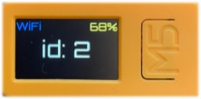
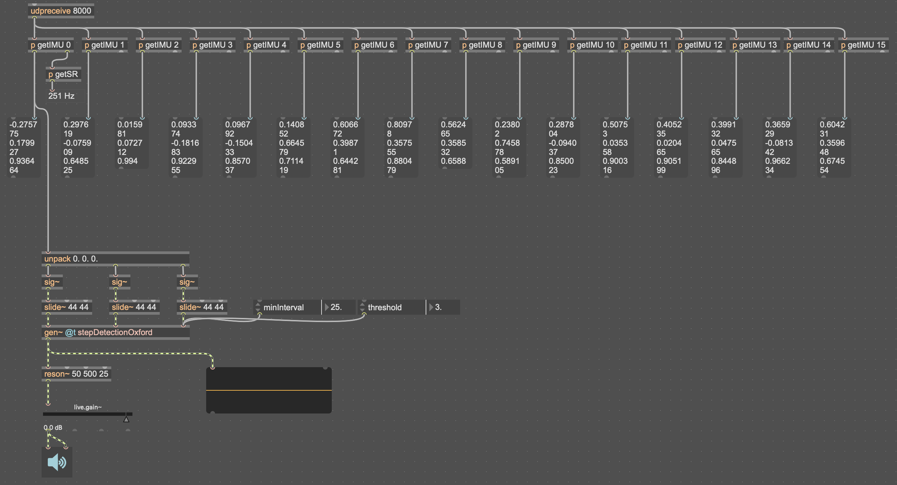
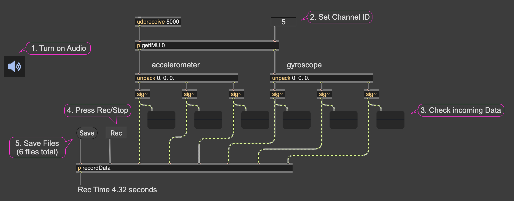
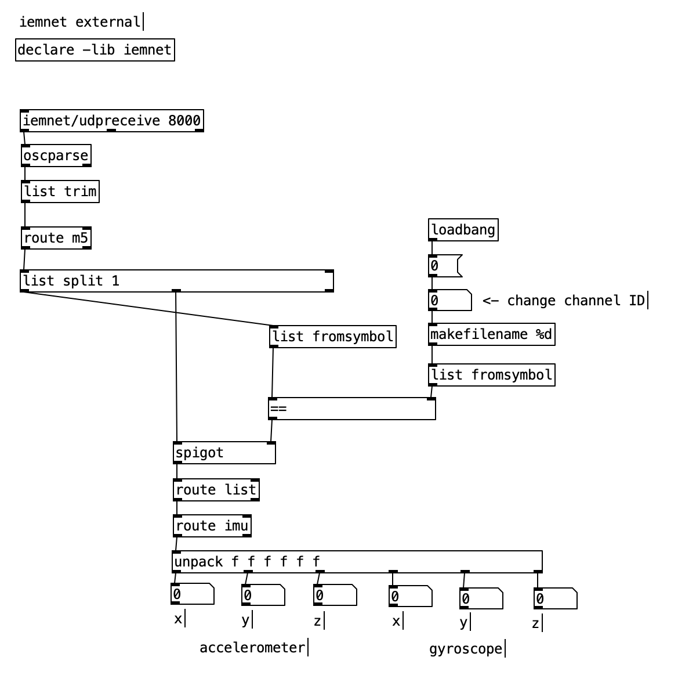
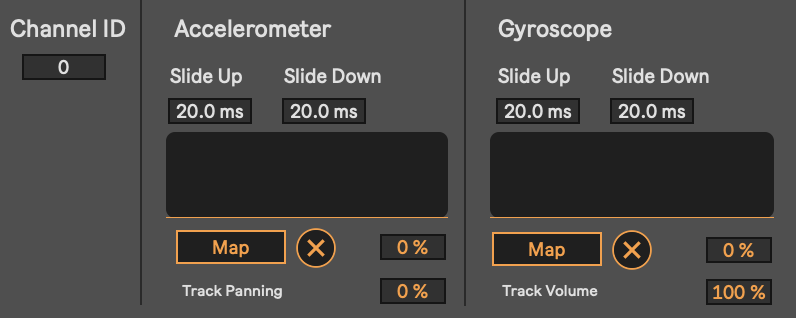
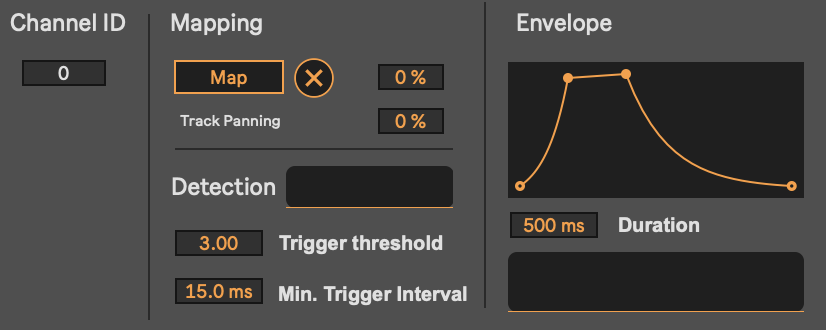

# M5StickC Plus2: OSC Motion Streaming

This project turns the **M5StickC Plus2** microcontroller into a wireless motion sensor.  
It captures **accelerometer and gyroscope data** in real time and streams it via **OSC over Wi-Fi** to any OSC-capable software (Max/MSP, PureData, etc.).

---

## Features

- Streams **accelerometer (ax, ay, az)** and **gyroscope (gx, gy, gz)** data at ~200 Hz  
- OSC messages sent to IP:PORT (default port: **8000**)  
- Format:  
  ```
  /m5/<channelId>/imu [ax ay az gx gy gz]
  ```
- **Channel IDs**  
  - Changeable via hardware buttons (increment/decrement)  
  - Saved in NVS and restored after reboot  
- **On-device feedback**  
  - Display shows channel ID, Wi-Fi, battery status  
  - Beeps confirm button presses and commits  
- **Battery optimizations**  
  - Adjustable brightness  
  - Optional Wi-Fi modem sleep  

  

---

## Use Case

Attach multiple units to performers (hands, feet, torso).  
Each device streams motion independently, enabling real-time **sonification of movement** in performance, installations, or research.

---

## Setup (Arduino IDE)

### 1. Board Support
- Add this URL in *Preferences → Additional Board Manager URLs*:  
  ```
  https://m5stack.oss-cn-shenzhen.aliyuncs.com/resource/arduino/package_m5stack_index.json
  ```
- Install **M5Stack Board Manager** (tested with v2.0.9)  
- Select **M5StickC Plus2** as the target board  

### 2. Required Libraries
Install via Arduino Library Manager (or GitHub):  
- [M5StickCPlus2](https://github.com/m5stack/M5StickCPlus2)  
- [M5Unified](https://github.com/m5stack/M5Unified)  
- [M5GFX](https://github.com/m5stack/M5GFX)  
- [OSC (CNMAT)](https://github.com/CNMAT/OSC)  

### 3. Wi-Fi & OSC Config
In the source code:  
```cpp
#define WIFI_SSID     "YourSSID"
#define WIFI_PASSWORD "YourPassword"

#define OUT_IP   "192.168.1.xxx"  // IP of OSC receiver
#define OUT_PORT 9000             // Port of OSC receiver
```

*Multi-user setup:*  
Devices can send IMU data to a Raspberry Pi, which re-broadcasts it across the network to multiple receivers.

---

## Requirements
- **Hardware**: M5StickC Plus2  
- **Software**: Arduino IDE with ESP32/M5Stack support  

---

## Code Examples

### Max/MSP 

#### 1. `M5_SensorInput.maxpat`
- Receive accelerometer + gyroscope for all channels  
- Step detection based on: [Oxford Step Counter](https://oxford-step-counter.github.io)  
- Max Version: 9.0.8


#### 2. `M5_SensorInputRecording.maxpat`
- Records Sensor inputs to 2 channel .WAV files
- Channel 1 = timestamp (decimal in seconds)  
- Channel 2 = data input
- 200 Hz sampling rate
- Output: 6 files (3 x accel, 3 x gyro)


### PureData `M5_SensorInput.pd`
- Receive IMU + gyroscope for one channel (adaptable to all)  
- needs: iemnet Extenral: version 0.3.0
- Pd Verison: 0.55.0



### Max for Live Devices

#### 1. `M5_Input_Magnitude.amxd`
Maps IMU magnitude to any Live parameter.  
- **Params**  
  - Slide Up/Down → logarithmic smoothing  
  - Param Range (%) → scales normalized [0–1] to target parameter range  
  - Set incoming channel ID
  


#### 2. `M5_Input_Accelerometer_Onset.amxd`
Maps accelerometer onsets to parameters using step detection ([Oxford Step Counter](https://oxford-step-counter.github.io)).  
- **Params**  
  - **Mapping**  
    - Param Range (%)  
  - **Detection**  
    - Trigger Threshold  
    - Min Trigger Interval (avoid retriggering)  
  - **Envelope**  
    - Curve shape + duration  
  - Set incoming channel ID
  

**Example Live Set**  
- Step/trigger → filter cutoff  
- Gyro magnitude → distortion/gain  
- Live Version: 12.2.5
